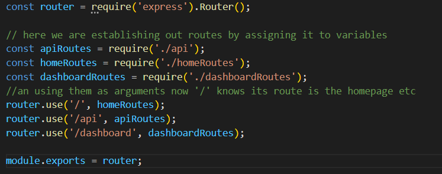

# cms-style-blog-post
[](https://opensource.org/licenses/MIT)

  #Table of Content
  - [description](#Description)
  - [installation](#Installation)
  - [usage](#Usage)
  - [credits](#Credits)
  - [license](#License)
  - [contact](#Contact)

  ## Description:
  The purpose behind this project was to create a CMS-style blog site were developers can publish their blog posts and comment on other developers posts as well. This project will showcase an MVC application which will contain model classes, view templates, and controller classes.

  Challenges: This was one of the more tougher assignments and I did struggle to complete it. In the future I hope to be able to return to this project and hopefully with ease be able to implement the necessary changes to give the application its full functionality. For now, you are able to create an account, login & logout, enter your dashboard, view the post edit layout, although my create route isnt working properly so you wont be able to actually add the post. However, you can naviagte between the dashboard and the homepage. 

  Below I have added an image that helped me conceptualize what MVC does:

   

  ## Installation:
  In order to be create this application the following technologies were utilized:
   
    - Express
    - Express-session
    - Express-handlebars
    - Mysql2
    - Sequelize
    - Connect-session-sequelize
    - dotenv
    - bcrypt

  One of the coolest parts about this project was using this authorization function throughout the routes to allow different levels of access between authorized and unauthorized users:

  

  Below, I have displayed how I created the comment model below:

   

  Below, I have displayed routes to display html content:

   


  ## Usage:

  When you first visit this blog site you will be able to view blog post others or yourself have created. In order to get the full functionality of this site you will need create an account or login in. Once the user is logged in they will be able to navigate from the dashboard, to the homepage, and the ability to logout. The homepage will exhibit post made by users including our own. The dashboard is where the user will be able to view all their post made, be able to create a post, update or delete it. This application will also allow user to interact with each other by allowing authorized users to make comment on psot.

 
  ```
  code-snippet

  ```

  ## Credits:
  MVC image provided by: https://www.geeksforgeeks.org/benefit-of-using-mvc/
  I utilized https://gist.github.com/lukas-h/2a5d00690736b4c3a7ba to generate markdown license badges.

 
  ## License:
  MIT 

  ## Contact:
  allleizq@gmail.com